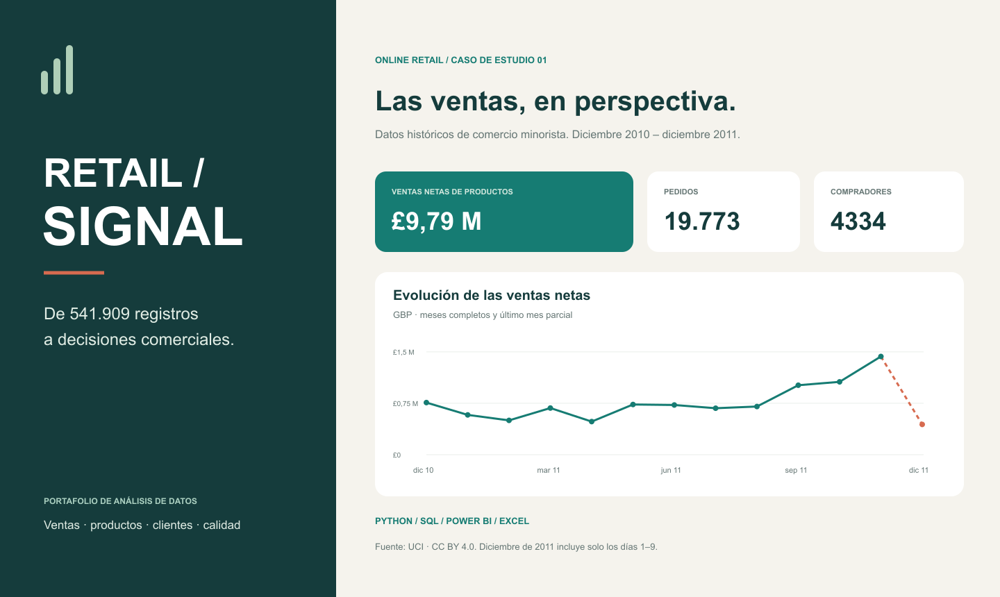
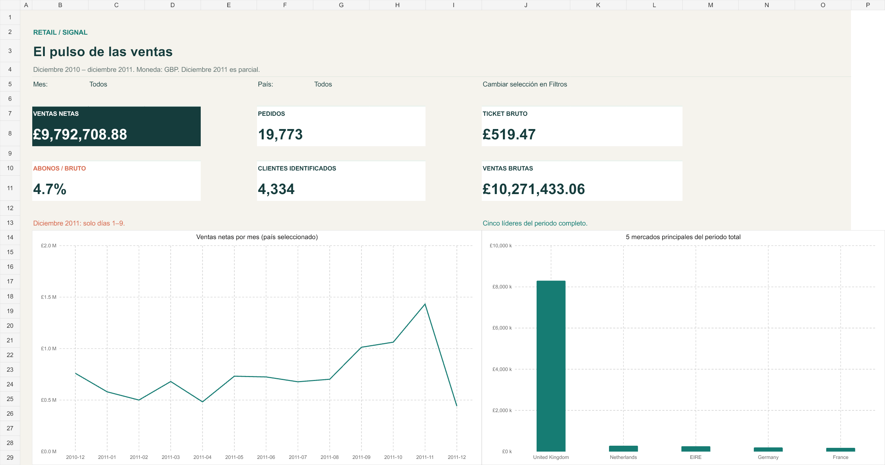

# RETAIL / SIGNAL

### De registros de venta a decisiones comerciales.



Caso de portafolio con datos públicos de **UCI Online Retail**. Python · SQL · Power BI · Excel.

El objetivo es convertir más de medio millón de líneas de documentos en una visión trazable de ventas, productos, clientes y abonos. No es un encargo de un cliente real ni un caso de mejoras comerciales implementadas.

## Explorar el proyecto

| Entregable | Acceso |
|---|---|
| Proyecto completo, con todas las carpetas y Power BI editable | [Descargar ZIP](Retail_Signal_Proyecto_Completo.zip) |
| Preparación de datos y análisis en Python | [src/analyze.py](src/analyze.py) |
| Ocho consultas de análisis en SQLite | [sql/analysis.sql](sql/analysis.sql) |
| Código complementario | [Carpeta src](src/) |
| Dashboard de Excel | [Dashboard_Ventas.xlsx](Dashboard_Ventas.xlsx) |
| Conclusiones y acciones propuestas | [Informe_Ejecutivo.pdf](Informe_Ejecutivo.pdf) |

El ZIP contiene la estructura completa del proyecto: código, consultas, modelo y reporte de Power BI, Excel, PDF, imágenes, pruebas, controles y documentación. No incluye datos completos, cachés ni rutas personales. Los archivos sueltos de este repositorio son una selección navegable para revisar el trabajo sin descargarlo.

**Para ejecutar o modificar el proyecto, descarga y extrae el ZIP primero.** No basta con descargar solo el archivo `.pbip`: necesita sus carpetas `.Report` y `.SemanticModel`.

## La pregunta de negocio

¿Cuánto vende realmente el negocio, qué productos y clientes explican sus resultados y qué registros requieren revisión?

El archivo de origen mezcla ventas, abonos, portes y ajustes. La unidad de análisis es una línea de documento, no un pedido. Los indicadores comerciales separan estos conceptos y documentan el criterio aplicado.

| Ventas netas de productos | Pedidos distintos | Compradores identificados |
|---:|---:|---:|
| £9.792.708,88 | 19.773 | 4.334 |

541.909 filas de origen → 536.465 líneas comerciales → 3.813 productos únicos.

El neto excluye portes, ajustes, vales y registros en revisión. No representa beneficio ni ingreso contable total. Periodo: diciembre de 2010 a diciembre de 2011; importes en GBP.

## Vista del dashboard Excel



Esta imagen es una vista renderizada del Excel, **no una captura de Power BI**. La portada también es una composición editorial, no una captura nativa.

## Tres hallazgos

- **Concentración al final del año.** Noviembre de 2011 alcanzó £1.432.734,99 netos, un 34,8% más que octubre. Un solo ciclo no prueba estacionalidad recurrente.
- **Concentración geográfica.** Reino Unido aporta el 84,8% del neto. Países Bajos lidera los mercados exteriores.
- **Abonos con contexto.** Dos pares extremos de venta y abono suman £245.653,20 en cada sentido, el 51,3% del importe abonado. No hay evidencia para afirmar su causa.

## Decisiones técnicas

- Normalizar `StockCode` a mayúsculas antes de construir las tablas, conservando su valor original para auditoría.
- Comprobar unicidad de dimensiones e integridad de relaciones.
- Conservar los posibles duplicados y presentar un análisis de sensibilidad: no hay identificador de línea que pruebe que sean errores.
- Conciliar importes en milésimas enteras de GBP en Python y SQLite.
- Incluir las ventas sin cliente identificado, sin contarlas como compradores conocidos.
- Tratar diciembre de 2011 como periodo parcial de nueve días.

## Power BI

El proyecto editable dentro del ZIP tiene cuatro páginas: **Panorama, Productos, Clientes y Calidad**. Incluye modelo estrella, medidas DAX, tema integrado, navegación lateral y filtros.

**Pendiente:** comprobar carga, DAX, interacciones y apariencia dentro de Power BI Desktop. Las pruebas de estructura y archivos no sustituyen esa revisión nativa. No se presenta el reporte como un PBIX validado.

## Reproducir el análisis

1. Descarga y extrae `Retail_Signal_Proyecto_Completo.zip`.
2. Abre una terminal en la carpeta extraída `retail-signal-analytics`.
3. Descarga el XLSX de [UCI Online Retail](https://doi.org/10.24432/C5BW33).
4. Ejecuta los comandos siguientes, sustituyendo las rutas de ejemplo:

```bash
python -m pip install -r requirements.txt
python src/analyze.py --input "RUTA/Online Retail.xlsx"
python src/configure_data.py --folder "RUTA/retail-signal-analytics/data/processed"
python -m unittest discover -s tests -v
```

Después, abre `powerbi/OnlineRetail.pbip` dentro de esa carpeta y actualiza. El README incluido en el ZIP explica las dependencias y los límites de reconstrucción de los artefactos.

## Fuente, autoría y alcance

Chen, D. (2015). [Online Retail — UCI Machine Learning Repository](https://doi.org/10.24432/C5BW33). Datos bajo **CC BY 4.0**, con transformaciones y atribución documentadas. Esta licencia de los datos no se presenta como licencia del código.

Proyecto desarrollado con asistencia de IA. Las decisiones, controles y limitaciones están documentados. No se inventaron costos, margen, motivos de abono ni resultados comerciales implementados.
